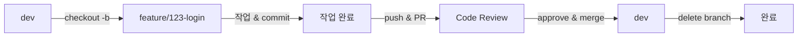

# Branch Strategy

## 📋 목차
- [Git Flow 전략](#git-flow-전략)
- [브랜치 종류](#브랜치-종류)
- [브랜치 워크플로우](#브랜치-워크플로우)
- [시나리오별 가이드](#시나리오별-가이드)

## 🌊 Git Flow 전략

본 프로젝트는 **Git Flow** 전략을 기반으로 브랜치를 관리합니다.

```
main (프로덕션)
  ↑
hotfix/* (긴급 수정)
  ↑
release/* (배포 준비)
  ↑
dev (개발)
  ↑
feature/* (기능 개발)
```

## 🌿 브랜치 종류

### 1. main
- **용도**: 프로덕션 배포 브랜치
- **특징**: 항상 배포 가능한 안정적인 상태 유지
- **보호**: 직접 푸시 금지, PR을 통해서만 병합
- **태그**: 배포 시 버전 태그 생성 (v1.0.0, v1.1.0 등)

```bash
# 절대 직접 작업하지 않음
# release 또는 hotfix 브랜치에서만 병합
```

### 2. dev
- **용도**: 개발 브랜치 (다음 배포를 위한 개발)
- **특징**: 최신 개발 사항이 반영됨
- **보호**: 직접 푸시 금지, PR을 통해서만 병합
- **병합 대상**: feature, fix 브랜치

```bash
# feature 브랜치들이 병합되는 통합 브랜치
```

### 3. feature/*
- **용도**: 새로운 기능 개발
- **분기**: dev에서 분기
- **병합**: dev으로 병합
- **삭제**: 병합 후 삭제

```bash
# 예시
feature/123-user-login
feature/124-product-list
feature/125-payment-system
```

### 4. fix/*
- **용도**: 버그 수정
- **분기**: dev에서 분기
- **병합**: dev으로 병합
- **삭제**: 병합 후 삭제

```bash
# 예시
fix/126-login-error
fix/127-validation-bug
```

### 5. hotfix/*
- **용도**: 프로덕션 긴급 버그 수정
- **분기**: main에서 분기
- **병합**: main과 dev 양쪽 모두 병합
- **삭제**: 병합 후 삭제

```bash
# 예시
hotfix/128-critical-security-fix
hotfix/129-payment-error
```

### 6. release/*
- **용도**: 배포 준비 (QA, 버그 수정)
- **분기**: dev에서 분기
- **병합**: main과 dev 양쪽 모두 병합
- **삭제**: 병합 후 삭제

```bash
# 예시
release/v1.0.0
release/v1.1.0
```

### 7. docs/*
- **용도**: 문서 작업
- **분기**: dev에서 분기
- **병합**: dev으로 병합
- **삭제**: 병합 후 삭제

```bash
# 예시
docs/130-update-readme
docs/131-api-documentation
```

## 🔄 브랜치 워크플로우

### 1. 새로운 기능 개발



**단계별 명령어**
```bash
# 1. dev 최신화
git checkout dev
git pull origin dev

# 2. feature 브랜치 생성
git checkout -b feature/123-user-login

# 3. 작업 및 커밋
git add .
git commit -m "feat(auth): 로그인 폼 UI 구현"

# 4. 원격 저장소에 푸시
git push origin feature/123-user-login

# 5. GitHub에서 PR 생성
# dev ← feature/123-user-login

# 6. 코드 리뷰 후 승인되면 Squash and Merge

# 7. 로컬 브랜치 정리
git checkout dev
git pull origin dev
git branch -d feature/123-user-login
```

### 2. 버그 수정

```bash
# dev에서 분기
git checkout dev
git pull origin dev
git checkout -b fix/124-validation-error

# 작업 후
git add .
git commit -m "fix(auth): 이메일 유효성 검증 오류 수정"
git push origin fix/124-validation-error

# PR 생성 → dev으로 병합
```

### 3. 배포 준비 (Release)

```bash
# 1. release 브랜치 생성
git checkout dev
git pull origin dev
git checkout -b release/v1.0.0

# 2. 버전 정보 업데이트
# package.json, CHANGELOG.md 등 수정

# 3. QA 및 버그 수정
git commit -m "chore: v1.0.0 릴리즈 준비"

# 4. main으로 병합
git checkout main
git pull origin main
git merge --no-ff release/v1.0.0
git tag -a v1.0.0 -m "Release version 1.0.0"
git push origin main --tags

# 5. dev으로도 병합
git checkout dev
git merge --no-ff release/v1.0.0
git push origin dev

# 6. release 브랜치 삭제
git branch -d release/v1.0.0
git push origin --delete release/v1.0.0
```

### 4. 긴급 버그 수정 (Hotfix)

```bash
# 1. main에서 hotfix 브랜치 생성
git checkout main
git pull origin main
git checkout -b hotfix/125-payment-error

# 2. 버그 수정
git add .
git commit -m "!HOTFIX(payment): 결제 모듈 오류 긴급 수정"

# 3. main으로 병합
git checkout main
git merge --no-ff hotfix/125-payment-error
git tag -a v1.0.1 -m "Hotfix version 1.0.1"
git push origin main --tags

# 4. dev으로도 병합
git checkout dev
git merge --no-ff hotfix/125-payment-error
git push origin dev

# 5. hotfix 브랜치 삭제
git branch -d hotfix/125-payment-error
git push origin --delete hotfix/125-payment-error
```

## 📝 시나리오별 가이드

### 시나리오 1: 새로운 기능 개발 시작

**상황**: 사용자 로그인 기능을 개발해야 함

```bash
# 1. 이슈 생성 (#123)
# 2. dev에서 브랜치 생성
git checkout dev
git pull origin dev
git checkout -b feature/123-user-login

# 3. 개발 진행
# 4. 주기적으로 커밋
git add .
git commit -m "feat(auth): 로그인 API 연동"

# 5. dev이 업데이트 되었다면 최신화
git checkout dev
git pull origin dev
git checkout feature/123-user-login
git merge dev  # 또는 git rebase dev

# 6. 개발 완료 후 푸시 및 PR
git push origin feature/123-user-login
```

### 시나리오 2: 여러 사람이 같은 기능 개발

**상황**: 대시보드 기능을 2명이 나눠서 개발

```bash
# 개발자 A: 대시보드 레이아웃
git checkout -b feature/124-dashboard-layout

# 개발자 B: 대시보드 차트
git checkout -b feature/125-dashboard-charts

# 각자 개발 후 dev에 순차적으로 병합
# A가 먼저 병합되면 B는 최신 dev을 받아서 충돌 해결
```

### 시나리오 3: 개발 중 긴급 버그 발견

**상황**: feature 개발 중 프로덕션에서 치명적 버그 발견

```bash
# 1. 현재 작업 임시 저장
git stash

# 2. main에서 hotfix 브랜치 생성
git checkout main
git pull origin main
git checkout -b hotfix/126-critical-bug

# 3. 버그 수정 및 배포
# ... (hotfix 워크플로우 진행)

# 4. 원래 작업으로 복귀
git checkout feature/123-user-login
git stash pop

# 5. hotfix 내용 받아오기
git merge dev
```

### 시나리오 4: PR 충돌 발생

**상황**: PR 생성했는데 dev과 충돌 발생

```bash
# 1. dev 최신 내용 가져오기
git checkout dev
git pull origin dev

# 2. feature 브랜치로 돌아가서 병합
git checkout feature/123-user-login
git merge dev

# 3. 충돌 해결
# 충돌 파일 수정

# 4. 병합 커밋
git add .
git commit -m "chore: dev 병합 및 충돌 해결"

# 5. 푸시
git push origin feature/123-user-login
```

## 📊 브랜치 수명 주기

| 브랜치 타입 | 생성 시점 | 삭제 시점 | 수명 |
|------------|----------|----------|------|
| main | 프로젝트 시작 | 영구 보존 | 영구 |
| dev | 프로젝트 시작 | 영구 보존 | 영구 |
| feature/* | 기능 개발 시작 | dev 병합 후 | 단기 |
| fix/* | 버그 발견 시 | dev 병합 후 | 단기 |
| hotfix/* | 긴급 버그 발견 시 | main/dev 병합 후 | 단기 |
| release/* | 배포 준비 시 | main/dev 병합 후 | 단기 |

## ⚙️ 브랜치 보호 규칙

### main 브랜치
- ✅ Require pull request reviews (전인원)
- ✅ Require status checks to pass (CI/CD)
- ✅ Require branches to be up to date
- ✅ Include administrators
- ❌ Allow force pushes
- ❌ Allow deletions

### dev 브랜치
- ✅ Require pull request reviews (최소 1명)
- ✅ Require status checks to pass (CI/CD)
- ✅ Require branches to be up to date
- ❌ Allow force pushes
- ❌ Allow deletions

## 🎯 Best Practices

1. **브랜치는 자주, 작게 만들기**
   - 하나의 기능/수정 = 하나의 브랜치
   - 큰 기능은 여러 브랜치로 분리

2. **정기적으로 dev 동기화**
   - 충돌을 최소화하기 위해 자주 병합
   - 최소 하루 1회 dev의 변경사항 가져오기

3. **브랜치는 빠르게 병합하기**
   - 오래 유지하면 충돌 확률 증가
   - 개발 완료 즉시 PR 생성

4. **병합 후 브랜치 삭제**
   - 불필요한 브랜치는 즉시 삭제
   - 로컬/원격 모두 정리

5. **커밋은 작고 의미있게**
   - 한 커밋은 하나의 논리적 변경
   - 커밋 메시지는 명확하게

## 🚫 하지 말아야 할 것

1. ❌ main/dev에 직접 푸시
2. ❌ 다른 사람의 브랜치에 무단 푸시
3. ❌ force push (특히 공유 브랜치)
4. ❌ 여러 기능을 한 브랜치에 섞기
5. ❌ 브랜치 네이밍 규칙 무시
6. ❌ 코드 리뷰 없이 병합
7. ❌ 테스트 실패한 코드 병합

## 📞 문의 및 제안

브랜치 전략에 대한 문의사항이나 개선 제안이 있다면 팀 회의에서 논의해주세요.