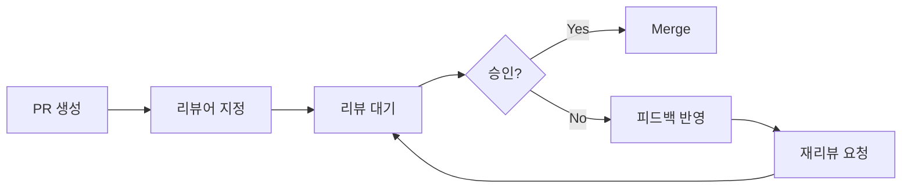
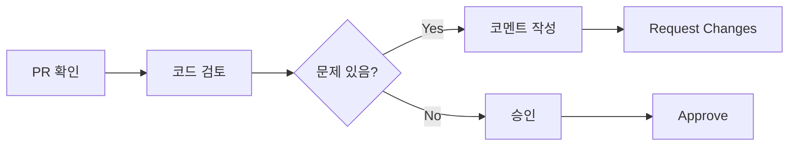

# Code Review Guide

## 📋 목차
- [Pull Request Convention](#pull-request-convention)
- [코드 리뷰 프로세스](#코드-리뷰-프로세스)
- [리뷰 체크리스트](#리뷰-체크리스트)
- [리뷰 코멘트 작성법](#리뷰-코멘트-작성법)
- [버그 리포트](#버그-리포트)
- [기능 제안](#기능-제안)

## 🔀 Pull Request Convention

### PR 제목 형식
```
[Type] 작업 내용 요약
```

### PR 타입

| Type | 설명 | 예시 |
|------|------|------|
| `Feat` | 새로운 기능 | `[Feat] 사용자 로그인 기능 구현` |
| `Fix` | 버그 수정 | `[Fix] 회원가입 유효성 검증 오류 수정` |
| `Docs` | 문서 수정 | `[Docs] README 설치 가이드 추가` |
| `Style` | 코드 스타일 | `[Style] 코드 포맷팅 적용` |
| `Refactor` | 리팩토링 | `[Refactor] API 호출 로직 개선` |
| `Test` | 테스트 | `[Test] 로그인 테스트 케이스 추가` |
| `Chore` | 기타 작업 | `[Chore] 의존성 업데이트` |
| `Design` | UI/UX 변경 | `[Design] 헤더 레이아웃 변경` |

### PR 제목 예시
```
[Feat] 사용자 로그인 기능 구현
[Fix] 회원가입 유효성 검증 오류 수정
[Docs] README 설치 가이드 추가
[Refactor] API 호출 로직 개선
[Test] E2E 테스트 추가
```

### PR 설명 템플릿

```markdown
## 작업 내용
이 PR에서 수행한 작업을 간단히 설명합니다.

## 변경 사항
- 변경 사항 1
- 변경 사항 2
- 변경 사항 3

## 테스트 방법
1. 테스트 단계 1
2. 테스트 단계 2
3. 예상 결과

## 스크린샷 (선택사항)
UI 변경이 있는 경우 스크린샷을 첨부합니다.
<!-- Before/After 형태로 첨부 -->

## 관련 이슈
Closes #123
Related to #456

## 체크리스트
- [ ] 코드 컨벤션을 준수했나요?
- [ ] 테스트를 작성했나요?
- [ ] 문서를 업데이트했나요?
- [ ] 충돌을 해결했나요?
- [ ] 모든 테스트가 통과했나요?
- [ ] 린트 검사를 통과했나요?
```

### PR 작성 예시

```markdown
## 작업 내용
사용자 로그인 기능을 구현했습니다. JWT 토큰 기반 인증을 사용하며, 
로그인 성공 시 토큰을 localStorage에 저장합니다.

## 변경 사항
- 로그인 폼 컴포넌트 추가 (LoginForm.vue)
- 로그인 API 연동 (api/auth.js)
- JWT 토큰 저장 및 관리 로직 구현 (stores/auth.js)
- 로그인 테스트 케이스 작성 (tests/auth.test.js)

## 테스트 방법
1. `/login` 페이지 접속
2. 이메일: test@example.com, 비밀번호: password123 입력
3. 로그인 버튼 클릭
4. 홈페이지로 리다이렉트 되고 사용자 정보가 표시됨

## 스크린샷
### 로그인 폼


### 로그인 성공


## 관련 이슈
Closes #123

## 체크리스트
- [x] 코드 컨벤션을 준수했나요?
- [x] 테스트를 작성했나요?
- [x] 문서를 업데이트했나요?
- [x] 충돌을 해결했나요?
- [x] 모든 테스트가 통과했나요?
- [x] 린트 검사를 통과했나요?
```

### PR 작성 규칙

#### 1. 작은 단위로 작성
- **한 PR에는 하나의 기능/수정만** 포함
- 큰 기능은 여러 PR로 분리
- 리뷰어가 이해하기 쉬운 크기 유지

```
✅ Good:
- PR #123: 로그인 폼 UI 구현
- PR #124: 로그인 API 연동
- PR #125: 로그인 테스트 작성

❌ Bad:
- PR #123: 로그인 전체 기능 구현 (20개 파일, 1000줄 변경)
```

#### 2. Self Review
PR 생성 전 스스로 코드를 리뷰합니다.

```markdown
체크 포인트:
- [ ] 불필요한 console.log 제거
- [ ] 주석 처리된 코드 제거
- [ ] 테스트 코드 작성
- [ ] 코드 컨벤션 준수
- [ ] 문서 업데이트
```

#### 3. Reviewer 지정
- **최소 1명 이상**의 리뷰어 지정
- 해당 영역 전문가를 리뷰어로 지정
- 신규 팀원의 경우 시니어 개발자 포함

#### 4. 리뷰 반영
- 리뷰 의견은 **성실히 반영**
- 반영하지 않을 경우 **명확한 이유 설명**
- 수정 완료 후 **재리뷰 요청**

#### 5. Merge 전 확인
- **모든 리뷰어의 승인** 확인
- **CI/CD 통과** 여부 확인
- **충돌 해결** 완료 확인

## 👀 코드 리뷰 프로세스

### 리뷰 받기 (PR 작성자)



#### 1단계: PR 생성
```bash
# 브랜치 푸시
git push origin feature/123-user-login

# GitHub에서 PR 생성
# base: dev ← compare: feature/123-user-login
```

#### 2단계: 리뷰어 지정
- 최소 1명 이상 지정
- 해당 영역 담당자 포함
- 신규 기능은 팀 리드 포함

#### 3단계: 리뷰 대기
- 리뷰어의 의견을 기다림
- 추가 질문에 신속히 답변
- 필요시 설명 추가

#### 4단계: 피드백 반영
```bash
# 피드백 반영 커밋
git add .
git commit -m "refactor(auth): 리뷰 피드백 반영"
git push origin feature/123-user-login
```

#### 5단계: 재리뷰 요청
- 수정 완료 후 재리뷰 요청
- 변경 내역 코멘트로 설명
- 승인 받으면 Merge

### 리뷰 하기 (리뷰어)



#### 1단계: PR 확인
- PR 설명 읽기
- 변경 사항 파악
- 관련 이슈 확인

#### 2단계: 코드 검토
- [리뷰 체크리스트](#리뷰-체크리스트) 확인
- 파일별로 꼼꼼히 검토
- 테스트 실행 결과 확인

#### 3단계: 코멘트 작성
- 건설적인 피드백 작성
- 구체적인 개선 방안 제시
- 긍정적인 피드백도 함께

#### 4단계: 리뷰 완료
- **Approve**: 문제 없음
- **Request Changes**: 수정 필요
- **Comment**: 의견만 남김

## ✅ 리뷰 체크리스트

### 기능성
- [ ] 요구사항을 충족하는가?
- [ ] 예상대로 동작하는가?
- [ ] 엣지 케이스를 처리하는가?
- [ ] 에러 처리가 적절한가?
- [ ] 성능에 문제가 없는가?

### 코드 품질
- [ ] 코드 컨벤션을 따르는가?
- [ ] 가독성이 좋은가?
- [ ] 중복 코드가 없는가?
- [ ] 적절히 모듈화되어 있는가?
- [ ] 변수/함수명이 명확한가?
- [ ] 주석이 적절한가?

### 테스트
- [ ] 테스트 코드가 작성되었는가?
- [ ] 테스트가 충분한가?
- [ ] 모든 테스트가 통과하는가?
- [ ] 엣지 케이스 테스트가 있는가?

### 문서
- [ ] 주석이 적절한가?
- [ ] README나 문서가 업데이트되었는가?
- [ ] API 문서가 업데이트되었는가?

### 보안
- [ ] 보안 취약점이 없는가?
- [ ] 민감 정보가 노출되지 않는가?
- [ ] 인증/인가가 적절한가?
- [ ] SQL Injection 등 취약점이 없는가?

### 성능
- [ ] 불필요한 연산이 없는가?
- [ ] 메모리 누수 가능성이 없는가?
- [ ] 데이터베이스 쿼리가 최적화되었는가?
- [ ] 캐싱이 적절히 사용되는가?

### 호환성
- [ ] 브라우저 호환성 문제가 없는가?
- [ ] 모바일 환경에서도 동작하는가?
- [ ] 기존 기능에 영향을 주지 않는가?

## 💬 리뷰 코멘트 작성법

### 건설적인 피드백

#### ✅ Good
```
이 부분은 함수로 분리하면 재사용성이 높아질 것 같습니다.
다음과 같이 수정하면 어떨까요?

function validateEmail(email) {
  // 검증 로직
}
```

#### ❌ Bad
```
이 코드는 별로네요.
```

---

### 구체적인 제안

#### ✅ Good
```
변수명을 userData보다는 currentUser가 더 명확할 것 같습니다.
현재 로그인한 사용자를 의미하는 것이 명확하게 전달됩니다.
```

#### ❌ Bad
```
변수명이 이상합니다.
```

---

### 질문하기

#### ✅ Good
```
이 로직을 선택한 특별한 이유가 있나요?
혹시 다른 방법도 고려해보셨는지 궁금합니다.
```

#### ❌ Bad
```
이게 왜 이렇게 작성됐죠?
```

---

### 긍정적인 피드백

#### ✅ Good
```
에러 처리를 꼼꼼하게 하셨네요! 👍
테스트 케이스가 잘 작성되었습니다!
코드가 읽기 쉽고 명확합니다.
```

---

### 중요도 표시

```
[Nit] 사소한 의견: 변수명을 좀 더 명확하게 하면 좋을 것 같아요.
[Minor] 작은 개선: 이 부분은 함수로 분리하면 좋을 것 같습니다.
[Major] 중요: 이 로직은 보안 이슈가 있어 수정이 필요합니다.
[Blocker] 병합 불가: 테스트가 실패하고 있습니다.
```

---

### 코드 제안

GitHub의 코드 제안 기능 활용:

```suggestion
// 기존 코드
const result = data.map(item => item.value).filter(value => value > 0)

// 제안 코드
const result = data
  .map(item => item.value)
  .filter(value => value > 0)
```

---

### 예시: 좋은 리뷰 코멘트

```markdown
## 전체적인 피드백
전반적으로 잘 작성되었습니다! 로그인 기능이 명확하게 구현되어 있네요. 👍

## 세부 코멘트

### src/components/LoginForm.vue (line 45)
[Minor] 이메일 검증 로직을 별도 함수로 분리하면 재사용하기 좋을 것 같습니다.

```javascript
// 제안
function validateEmail(email) {
  const emailRegex = /^[^\s@]+@[^\s@]+\.[^\s@]+$/;
  return emailRegex.test(email);
}
```

### src/api/auth.js (line 23)
[Major] 에러 처리가 누락되어 있습니다. try-catch로 감싸주세요.

```javascript
try {
  const response = await axios.post('/login', credentials);
  return response.data;
} catch (error) {
  console.error('Login failed:', error);
  throw error;
}
```

### src/stores/auth.js (line 67)
[Nit] 변수명을 `userData`보다는 `currentUser`가 더 명확할 것 같습니다.

### tests/auth.test.js
테스트 케이스가 잘 작성되었습니다! 엣지 케이스까지 고려하셨네요. 👍
```

## 🐛 버그 리포트

### 버그 발견 시 절차

#### 1단계: 이슈 검색
먼저 동일한 버그가 이미 보고되었는지 확인합니다.

#### 2단계: 버그 리포트 작성
새로운 이슈를 생성하고 Bug Report 템플릿을 사용합니다.

```markdown
## 버그 설명
로그인 시 토큰이 저장되지 않는 문제

## 재현 방법
1. 로그인 페이지 접속
2. 유효한 계정으로 로그인
3. 페이지 새로고침
4. 로그인 상태가 유지되지 않음

## 예상 동작
로그인 후 토큰이 localStorage에 저장되어야 함

## 실제 동작
토큰이 저장되지 않고 페이지 새로고침 시 로그아웃됨

## 환경
- OS: macOS Sonoma 14.0
- Browser: Chrome 119
- Version: 1.0.0

## 추가 정보
- 콘솔에 에러 메시지 없음
- 개발자 도구 > Application > Local Storage 확인 시 토큰 없음

## 스크린샷

```

#### 3단계: 버그 수정
이슈가 승인되면 브랜치를 생성하고 수정을 진행합니다.

```bash
git checkout -b fix/125-token-storage-bug
```

#### 4단계: PR 생성
수정 완료 후 PR을 생성합니다.

```markdown
[Fix] 로그인 토큰 저장 버그 수정

Closes #125
```

## 💡 기능 제안

### 기능 제안 절차

#### 1단계: 이슈 생성
Feature Request 템플릿을 사용하여 이슈를 생성합니다.

```markdown
## 기능 설명
다크 모드 지원 기능

## 동기
- 사용자들이 다크 모드를 선호함
- 눈의 피로를 줄일 수 있음
- 배터리 소모 감소 (OLED 화면)

## 제안하는 해결 방법
1. 테마 토글 버튼 추가 (헤더 우측)
2. 로컬 스토리지에 테마 설정 저장
3. CSS 변수를 사용한 테마 시스템 구현
4. 시스템 테마 설정 자동 감지

## 대안
- 시스템 설정을 따르는 자동 테마 변경만 구현
- 여러 테마 옵션 제공 (라이트, 다크, 블루 등)

## 추가 정보
- Figma 디자인: [링크]
- 참고 사이트: GitHub, Twitter
```

#### 2단계: 논의
팀과 기능에 대해 논의하고 승인을 받습니다.

#### 3단계: 구현
승인되면 기능을 구현하고 PR을 생성합니다.

```markdown
[Feat] 다크 모드 지원 기능 추가

Closes #130
```

## 🎯 리뷰 Best Practices

### 리뷰어를 위한 팁

1. **빠르게 리뷰하기**
   - PR 생성 후 24시간 내 1차 리뷰
   - 작은 PR은 당일 리뷰 완료

2. **명확하게 소통하기**
   - 모호한 표현 지양
   - 구체적인 예시 제공
   - 이유와 근거 설명

3. **긍정적으로 접근하기**
   - 좋은 점도 함께 언급
   - 비난이 아닌 개선 제안
   - 배려하는 태도 유지

4. **일관성 유지하기**
   - 동일한 기준 적용
   - 컨벤션 준수 확인
   - 이전 리뷰와 일관성

### PR 작성자를 위한 팁

1. **이해하기 쉽게 작성**
   - 명확한 PR 설명
   - 변경 이유 설명
   - 스크린샷 첨부

2. **작은 단위로 작성**
   - 리뷰하기 쉬운 크기
   - 하나의 목적만 포함
   - 관련 없는 변경 제외

3. **피드백에 열린 자세**
   - 방어적이지 않기
   - 의견 경청하기
   - 배울 점 찾기

4. **빠르게 반응하기**
   - 질문에 신속히 답변
   - 피드백 빠르게 반영
   - 막히면 도움 요청

## ⚠️ 주의사항

### 하지 말아야 할 것

1. ❌ 리뷰 없이 Merge
2. ❌ 테스트 실패한 코드 Merge
3. ❌ 큰 PR 생성 (500줄 이상)
4. ❌ 무례한 코멘트 작성
5. ❌ 승인 없이 강제 Merge
6. ❌ 코멘트 무시하고 Merge
7. ❌ 오래된 PR 방치

### 해야 할 것

1. ✅ 최소 1명 이상 승인 후 Merge
2. ✅ 모든 테스트 통과 확인
3. ✅ 작은 단위로 PR 생성
4. ✅ 건설적인 피드백 작성
5. ✅ 모든 리뷰어 승인 후 Merge
6. ✅ 피드백 성실히 반영
7. ✅ 24시간 내 리뷰 완료

## 📚 참고 자료

- [Google Code Review Guidelines](https://google.github.io/eng-practices/review/)
- [GitHub Pull Request Best Practices](https://docs.github.com/en/pull-requests/collaborating-with-pull-requests)
- [Conventional Comments](https://conventionalcomments.org/)

## 💬 질문 및 지원

코드 리뷰 관련 질문이 있으면:
- GitHub Issues에 질문 이슈 생성
- 팀 Slack 채널에 문의
- 팀 회의에서 논의