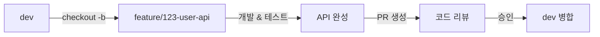

# Backend Git Workflow

## 목차
- [Git Flow 전략](#git-flow-전략)
- [브랜치 종류](#브랜치-종류)
- [브랜치 네이밍 규칙](#브랜치-네이밍-규칙)
- [백엔드 워크플로우](#백엔드-워크플로우)
- [시나리오별 가이드](#시나리오별-가이드)
- [Best Practices](#best-practices)

## Git Flow 전략

백엔드 프로젝트는 **Git Flow** 전략을 기반으로 브랜치를 관리합니다.

```
main (프로덕션)
  ↑
hotfix/* (긴급 서버 버그 수정)
  ↑
release/* (배포 준비)
  ↑
dev (개발)
  ↑
feature/* (API/기능 개발)
```

## 브랜치 종류

### 1. main
- **용도**: 프로덕션 배포 브랜치
- **특징**: 항상 배포 가능한 안정적인 상태 유지
- **보호**: 직접 푸시 금지, PR을 통해서만 병합
- **태그**: 배포 시 버전 태그 생성 (v1.0.0, v1.1.0 등)

### 2. dev
- **용도**: 개발 브랜치 (다음 배포를 위한 개발)
- **특징**: 최신 개발 사항이 반영됨
- **보호**: 직접 푸시 금지, PR을 통해서만 병합

### 3. feature/*
- **용도**: 새로운 API/기능 개발
- **분기**: dev에서 분기
- **병합**: dev으로 병합
- **삭제**: 병합 후 삭제

```bash
# 백엔드 feature 브랜치 예시
feature/123-user-registration-api
feature/124-jwt-authentication
feature/125-product-search-api
feature/126-order-payment-integration
feature/127-batch-notification
```

### 4. fix/*
- **용도**: API/로직 버그 수정
- **분기**: dev에서 분기
- **병합**: dev으로 병합

```bash
# 백엔드 fix 브랜치 예시
fix/128-token-expiration-bug
fix/129-query-performance-issue
fix/130-transaction-rollback-error
fix/131-null-pointer-exception
```

### 5. hotfix/*
- **용도**: 프로덕션 긴급 버그 수정
- **분기**: main에서 분기
- **병합**: main과 dev 양쪽 모두 병합

```bash
# 백엔드 hotfix 브랜치 예시
hotfix/132-payment-calculation-error
hotfix/133-security-vulnerability
hotfix/134-database-connection-leak
```

### 6. release/*
- **용도**: 배포 준비 (QA, 버그 수정, 마이그레이션)
- **분기**: dev에서 분기
- **병합**: main과 dev 양쪽 모두 병합

```bash
# 백엔드 release 브랜치 예시
release/v1.0.0
release/v1.1.0
```

## 브랜치 네이밍 규칙

### 브랜치명 형식
```
<type>/<issue-number>-<short-description>
```

### 백엔드 브랜치 타입

| 타입 | 설명 | 예시 |
|------|------|------|
| `feature` | 새로운 API/기능 | `feature/123-user-api` |
| `fix` | 버그 수정 | `fix/124-query-bug` |
| `hotfix` | 긴급 버그 수정 | `hotfix/125-payment-error` |
| `release` | 배포 준비 | `release/v1.0.0` |
| `refactor` | 코드 리팩토링 | `refactor/126-service-layer` |
| `perf` | 성능 개선 | `perf/127-query-optimization` |
| `test` | 테스트 추가 | `test/128-integration-tests` |

### 브랜치명 예시 (백엔드 특화)

```bash
# API 개발
feature/100-user-crud-api
feature/101-auth-login-api
feature/102-product-search-api
feature/103-order-create-api

# 도메인/비즈니스 로직
feature/104-payment-processing
feature/105-inventory-management
feature/106-notification-system

# 인프라
feature/107-redis-caching
feature/108-kafka-integration
feature/109-batch-scheduler

# 성능 개선
perf/110-query-optimization
perf/111-connection-pooling
perf/112-caching-strategy

# 버그 수정
fix/113-transaction-isolation
fix/114-deadlock-issue
fix/115-memory-leak
```

## 백엔드 워크플로우

### 1. 새로운 API 개발



**단계별 명령어**
```bash
# 1. dev 최신화
git checkout dev
git pull origin dev

# 2. feature 브랜치 생성
git checkout -b feature/123-user-registration-api

# 3. 레이어별 개발 및 커밋
# 3-1. 엔티티/도메인
git commit -m "feat(domain): User 엔티티 추가"

# 3-2. 레포지토리
git commit -m "feat(repository): UserRepository 인터페이스 정의"

# 3-3. 서비스
git commit -m "feat(service): 회원가입 비즈니스 로직 구현"

# 3-4. 컨트롤러
git commit -m "feat(controller): POST /api/users 회원가입 API 추가"

# 3-5. 테스트
git commit -m "test(user): 회원가입 서비스 유닛 테스트 작성"
git commit -m "test(user): 회원가입 API 통합 테스트 작성"

# 4. 푸시 및 PR 생성
git push origin feature/123-user-registration-api
```

### 2. 데이터베이스 마이그레이션 포함 작업

```bash
# dev에서 분기
git checkout dev
git pull origin dev
git checkout -b feature/124-orders-table

# 1. 마이그레이션 먼저 커밋
git commit -m "feat(db): orders 테이블 마이그레이션 추가"
git commit -m "feat(db): orders 테이블 인덱스 추가"

# 2. 도메인 로직 개발
git commit -m "feat(domain): Order 엔티티 추가"
git commit -m "feat(repository): OrderRepository 구현"
git commit -m "feat(service): 주문 생성 비즈니스 로직 구현"
git commit -m "feat(controller): POST /api/orders 주문 생성 API 추가"

# 3. 테스트
git commit -m "test(order): 주문 서비스 유닛 테스트 작성"
git commit -m "test(order): 주문 API 통합 테스트 작성"

git push origin feature/124-orders-table
```

### 3. 성능 개선 작업

```bash
git checkout dev
git pull origin dev
git checkout -b perf/125-product-query-optimization

# 쿼리 분석 및 최적화
git commit -m "perf(query): 상품 목록 조회 쿼리 분석"
git commit -m "perf(db): products 테이블 인덱스 추가"
git commit -m "perf(query): 상품 조회 시 N+1 문제 해결"
git commit -m "perf(cache): 인기 상품 Redis 캐싱 적용"
git commit -m "test(product): 성능 테스트 추가"

git push origin perf/125-product-query-optimization
```

### 4. 배포 준비 (Release)

```bash
# 1. release 브랜치 생성
git checkout dev
git pull origin dev
git checkout -b release/v1.0.0

# 2. 버전 정보 업데이트
# - pom.xml 또는 build.gradle 버전 수정
# - CHANGELOG.md 업데이트
git commit -m "chore: v1.0.0 릴리즈 준비"

# 3. QA 진행 중 발견된 버그 수정
git commit -m "fix(order): QA에서 발견된 주문 금액 계산 오류 수정"

# 4. main으로 병합
git checkout main
git pull origin main
git merge --no-ff release/v1.0.0
git tag -a v1.0.0 -m "Release version 1.0.0"
git push origin main --tags

# 5. dev으로도 병합
git checkout dev
git merge --no-ff release/v1.0.0
git push origin dev

# 6. release 브랜치 삭제
git branch -d release/v1.0.0
git push origin --delete release/v1.0.0
```

### 5. 긴급 버그 수정 (Hotfix)

```bash
# 1. main에서 hotfix 브랜치 생성
git checkout main
git pull origin main
git checkout -b hotfix/126-payment-calculation-error

# 2. 버그 수정
git add .
git commit -m "!HOTFIX(payment): 결제 금액 소수점 계산 오류 긴급 수정"

# 3. 테스트 추가
git commit -m "test(payment): 결제 금액 계산 테스트 케이스 추가"

# 4. main으로 병합
git checkout main
git merge --no-ff hotfix/126-payment-calculation-error
git tag -a v1.0.1 -m "Hotfix version 1.0.1"
git push origin main --tags

# 5. dev으로도 병합
git checkout dev
git merge --no-ff hotfix/126-payment-calculation-error
git push origin dev

# 6. hotfix 브랜치 삭제
git branch -d hotfix/126-payment-calculation-error
git push origin --delete hotfix/126-payment-calculation-error
```

## 시나리오별 가이드

### 시나리오 1: 인증 시스템 구현

**상황**: JWT 기반 인증 시스템을 구현해야 함

```bash
# 1. 이슈 생성 (#200)
# 2. dev에서 브랜치 생성
git checkout dev
git pull origin dev
git checkout -b feature/200-jwt-authentication

# 3. 단계별 개발
# 3-1. JWT 유틸리티
git commit -m "feat(auth): JwtTokenProvider 구현"

# 3-2. Security 설정
git commit -m "feat(security): Spring Security 설정 추가"
git commit -m "feat(security): JwtAuthenticationFilter 구현"

# 3-3. 로그인 API
git commit -m "feat(auth): 로그인 서비스 구현"
git commit -m "feat(auth): POST /api/auth/login API 추가"

# 3-4. 토큰 갱신
git commit -m "feat(auth): Refresh Token 저장 (Redis)"
git commit -m "feat(auth): POST /api/auth/refresh 토큰 갱신 API 추가"

# 3-5. 테스트
git commit -m "test(auth): 인증 서비스 유닛 테스트 작성"
git commit -m "test(auth): 인증 API 통합 테스트 작성"

# 4. 푸시 및 PR
git push origin feature/200-jwt-authentication
```

### 시나리오 2: 외부 API 연동

**상황**: 결제 시스템 외부 API 연동

```bash
git checkout dev
git pull origin dev
git checkout -b feature/201-payment-gateway-integration

# 외부 API 클라이언트
git commit -m "feat(payment): PaymentGateway 클라이언트 구현"

# 결제 서비스
git commit -m "feat(payment): 결제 처리 서비스 구현"

# 웹훅 처리
git commit -m "feat(payment): 결제 웹훅 핸들러 구현"

# 재시도 로직
git commit -m "feat(payment): 결제 실패 시 재시도 로직 추가"

# 테스트
git commit -m "test(payment): Mock을 활용한 결제 서비스 테스트 작성"

git push origin feature/201-payment-gateway-integration
```

### 시나리오 3: 배치 작업 개발

**상황**: 일일 정산 배치 작업 개발

```bash
git checkout dev
git pull origin dev
git checkout -b feature/202-daily-settlement-batch

# 배치 설정
git commit -m "feat(batch): Spring Batch 설정 추가"

# Job 구현
git commit -m "feat(batch): 일일 정산 Job 구현"

# Step 구현
git commit -m "feat(batch): 주문 데이터 조회 Step 구현"
git commit -m "feat(batch): 정산 금액 계산 Step 구현"
git commit -m "feat(batch): 정산 결과 저장 Step 구현"

# 스케줄러
git commit -m "feat(scheduler): 일일 정산 배치 스케줄러 설정"

# 테스트
git commit -m "test(batch): 일일 정산 배치 테스트 작성"

git push origin feature/202-daily-settlement-batch
```

### 시나리오 4: 동시성 이슈 해결

**상황**: 재고 차감 시 동시성 이슈 발생

```bash
git checkout dev
git pull origin dev
git checkout -b fix/203-inventory-concurrency-issue

# 문제 분석 및 락 적용
git commit -m "fix(inventory): 재고 차감 시 비관적 락 적용"

# 테스트 추가
git commit -m "test(inventory): 동시성 테스트 케이스 추가"

# 문서화
git commit -m "docs(inventory): 동시성 처리 관련 주석 추가"

git push origin fix/203-inventory-concurrency-issue
```

### 시나리오 5: 마이크로서비스 간 통신

**상황**: 주문 서비스에서 상품 서비스 호출 필요

```bash
git checkout dev
git pull origin dev
git checkout -b feature/204-order-product-integration

# Feign 클라이언트
git commit -m "feat(feign): ProductServiceClient 인터페이스 정의"

# Fallback 처리
git commit -m "feat(feign): ProductServiceFallback 구현"

# Circuit Breaker
git commit -m "feat(resilience): Circuit Breaker 설정 추가"

# 서비스 통합
git commit -m "feat(order): 주문 시 상품 서비스 호출 연동"

# 테스트
git commit -m "test(order): WireMock을 활용한 통합 테스트 작성"

git push origin feature/204-order-product-integration
```

## Best Practices

### 1. 레이어별로 커밋 분리
```bash
# Good - 레이어별 분리
git commit -m "feat(domain): Order 엔티티 추가"
git commit -m "feat(repository): OrderRepository 구현"
git commit -m "feat(service): OrderService 구현"
git commit -m "feat(controller): OrderController 추가"

# Bad - 모든 레이어를 한번에
git commit -m "feat(order): 주문 기능 전체 구현"
```

### 2. 마이그레이션은 반드시 별도 커밋
```bash
# 마이그레이션 먼저
git commit -m "feat(db): users 테이블 생성 마이그레이션"

# 그 다음 코드
git commit -m "feat(user): User 엔티티 및 서비스 구현"
```

### 3. 테스트와 함께 커밋
```bash
# 기능 개발 후 바로 테스트
git commit -m "feat(user): 회원가입 서비스 구현"
git commit -m "test(user): 회원가입 서비스 테스트 작성"
```

### 4. API 변경 시 문서도 함께
```bash
git commit -m "feat(api): GET /api/products 상품 목록 API 추가"
git commit -m "docs(api): Swagger 문서 업데이트"
```

### 5. 성능 관련 변경은 측정 결과 포함
```bash
git commit -m "perf(query): 상품 조회 쿼리 최적화 (2000ms → 150ms)"
```

## 하지 말아야 할 것

1. main/dev에 직접 푸시
2. 마이그레이션과 코드 변경을 한 커밋에 혼합
3. 테스트 없이 PR 생성
4. 민감 정보 (API 키, 비밀번호) 커밋
5. 큰 기능을 한 커밋에 모두 포함
6. 로컬 설정 파일 커밋
7. 테스트 실패한 코드 푸시

## 자주 사용하는 Git 명령어

```bash
# 현재 브랜치 확인
git branch

# 브랜치 생성 및 전환
git checkout -b feature/123-new-api

# 특정 파일만 add
git add src/main/java/com/example/User.java

# 커밋 메시지 수정
git commit --amend -m "새로운 메시지"

# 최근 커밋 취소 (변경사항 유지)
git reset --soft HEAD~1

# Stash (임시 저장)
git stash
git stash pop

# 태그 생성
git tag -a v1.0.0 -m "Release version 1.0.0"

# 원격 태그 푸시
git push origin --tags

# Cherry-pick (특정 커밋만 가져오기)
git cherry-pick <commit-hash>
```

## 참고 자료

- [Git Flow](https://nvie.com/posts/a-successful-git-branching-model/)
- [Semantic Versioning](https://semver.org/)
- [Spring Boot Best Practices](https://spring.io/guides)
- [Database Migration Best Practices](https://flywaydb.org/documentation/bestpractices)
