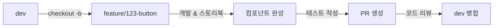

# Frontend Git Workflow

## 목차
- [Git Flow 전략](#git-flow-전략)
- [브랜치 종류](#브랜치-종류)
- [브랜치 네이밍 규칙](#브랜치-네이밍-규칙)
- [프론트엔드 워크플로우](#프론트엔드-워크플로우)
- [시나리오별 가이드](#시나리오별-가이드)
- [Best Practices](#best-practices)

## Git Flow 전략

프론트엔드 프로젝트는 **Git Flow** 전략을 기반으로 브랜치를 관리합니다.

```
main (프로덕션)
  ↑
hotfix/* (긴급 UI 버그 수정)
  ↑
release/* (배포 준비)
  ↑
dev (개발)
  ↑
feature/* (기능/컴포넌트 개발)
```

## 브랜치 종류

### 1. main
- **용도**: 프로덕션 배포 브랜치
- **특징**: 항상 배포 가능한 안정적인 상태 유지
- **보호**: 직접 푸시 금지, PR을 통해서만 병합

### 2. dev
- **용도**: 개발 브랜치 (다음 배포를 위한 개발)
- **특징**: 최신 개발 사항이 반영됨
- **보호**: 직접 푸시 금지, PR을 통해서만 병합

### 3. feature/*
- **용도**: 새로운 기능/컴포넌트 개발
- **분기**: dev에서 분기
- **병합**: dev으로 병합
- **삭제**: 병합 후 삭제

```bash
# 프론트엔드 feature 브랜치 예시
feature/123-login-form
feature/124-product-list-component
feature/125-shopping-cart-ui
feature/126-responsive-header
feature/127-dark-mode-toggle
```

### 4. fix/*
- **용도**: UI/기능 버그 수정
- **분기**: dev에서 분기
- **병합**: dev으로 병합

```bash
# 프론트엔드 fix 브랜치 예시
fix/128-button-click-issue
fix/129-modal-close-bug
fix/130-responsive-layout-break
fix/131-form-validation-error
```

### 5. design/*
- **용도**: 디자인/스타일 변경
- **분기**: dev에서 분기
- **병합**: dev으로 병합

```bash
# 프론트엔드 design 브랜치 예시
design/132-header-redesign
design/133-color-palette-update
design/134-mobile-layout-improvement
```

### 6. hotfix/*
- **용도**: 프로덕션 긴급 UI 버그 수정
- **분기**: main에서 분기
- **병합**: main과 dev 양쪽 모두 병합

```bash
# 프론트엔드 hotfix 브랜치 예시
hotfix/135-checkout-button-not-working
hotfix/136-payment-form-crash
```

## 브랜치 네이밍 규칙

### 브랜치명 형식
```
<type>/<issue-number>-<short-description>
```

### 프론트엔드 브랜치 타입

| 타입 | 설명 | 예시 |
|------|------|------|
| `feature` | 새로운 기능/컴포넌트 | `feature/123-login-form` |
| `fix` | UI/기능 버그 수정 | `fix/124-button-event-bug` |
| `design` | 디자인/스타일 변경 | `design/125-header-layout` |
| `hotfix` | 긴급 버그 수정 | `hotfix/126-payment-crash` |
| `refactor` | 코드 리팩토링 | `refactor/127-state-management` |
| `test` | 테스트 추가 | `test/128-component-tests` |

### 브랜치명 예시 (프론트엔드 특화)

```bash
# 컴포넌트 개발
feature/100-button-component
feature/101-modal-component
feature/102-dropdown-component

# 페이지 개발
feature/103-login-page
feature/104-product-detail-page
feature/105-checkout-page

# 기능 개발
feature/106-infinite-scroll
feature/107-image-lazy-loading
feature/108-dark-mode

# 반응형
design/109-mobile-responsive
design/110-tablet-layout

# 버그 수정
fix/111-ie11-compatibility
fix/112-safari-scroll-issue
```

## 프론트엔드 워크플로우

### 1. 새로운 컴포넌트 개발



**단계별 명령어**
```bash
# 1. dev 최신화
git checkout dev
git pull origin dev

# 2. feature 브랜치 생성
git checkout -b feature/123-button-component

# 3. 컴포넌트 개발
# - Button.vue 작성
# - Button.stories.js 스토리북 작성
# - Button.test.js 테스트 작성

# 4. 커밋
git add .
git commit -m "feat(button): 기본 버튼 컴포넌트 추가"
git commit -m "feat(button): 버튼 variants 추가 (primary, secondary)"
git commit -m "test(button): 버튼 컴포넌트 테스트 작성"

# 5. 푸시 및 PR 생성
git push origin feature/123-button-component
```

### 2. 페이지 개발

```bash
# dev에서 분기
git checkout dev
git pull origin dev
git checkout -b feature/124-product-list-page

# 페이지 개발 (여러 커밋으로 분리)
git commit -m "feat(product): 상품 목록 페이지 레이아웃 구현"
git commit -m "feat(product): 상품 카드 컴포넌트 추가"
git commit -m "feat(product): 상품 필터링 기능 구현"
git commit -m "feat(product): 무한 스크롤 적용"
git commit -m "design(product): 모바일 반응형 적용"
git commit -m "test(product): 상품 목록 E2E 테스트 작성"

# 푸시
git push origin feature/124-product-list-page
```

### 3. 디자인/스타일 변경

```bash
git checkout dev
git pull origin dev
git checkout -b design/125-header-redesign

# 디자인 작업
git commit -m "design(header): 헤더 레이아웃 변경"
git commit -m "design(header): 네비게이션 스타일 개선"
git commit -m "design(header): 모바일 햄버거 메뉴 추가"

git push origin design/125-header-redesign
```

### 4. 반응형 작업

```bash
git checkout dev
git pull origin dev
git checkout -b design/126-mobile-responsive

# 반응형 작업 (브레이크포인트별 커밋)
git commit -m "design(layout): 태블릿 반응형 적용 (768px)"
git commit -m "design(layout): 모바일 반응형 적용 (480px)"
git commit -m "fix(layout): 작은 화면에서 카드 깨짐 수정"

git push origin design/126-mobile-responsive
```

### 5. 긴급 UI 버그 수정 (Hotfix)

```bash
# 1. main에서 hotfix 브랜치 생성
git checkout main
git pull origin main
git checkout -b hotfix/127-checkout-button-bug

# 2. 버그 수정
git add .
git commit -m "!HOTFIX(checkout): 결제 버튼 클릭 안되는 버그 수정"

# 3. main으로 병합
git checkout main
git merge --no-ff hotfix/127-checkout-button-bug
git tag -a v1.0.1 -m "Hotfix: checkout button bug"
git push origin main --tags

# 4. dev으로도 병합
git checkout dev
git merge --no-ff hotfix/127-checkout-button-bug
git push origin dev

# 5. hotfix 브랜치 삭제
git branch -d hotfix/127-checkout-button-bug
```

## 시나리오별 가이드

### 시나리오 1: 새로운 페이지 기능 개발

**상황**: 사용자 프로필 페이지를 개발해야 함

```bash
# 1. 이슈 생성 (#200)
# 2. dev에서 브랜치 생성
git checkout dev
git pull origin dev
git checkout -b feature/200-profile-page

# 3. 단계별 개발 및 커밋
# 3-1. 레이아웃 구현
git commit -m "feat(profile): 프로필 페이지 레이아웃 구현"

# 3-2. 컴포넌트 개발
git commit -m "feat(profile): 프로필 이미지 업로드 컴포넌트 추가"
git commit -m "feat(profile): 프로필 정보 폼 컴포넌트 추가"

# 3-3. API 연동
git commit -m "feat(profile): 프로필 조회 API 연동"
git commit -m "feat(profile): 프로필 수정 API 연동"

# 3-4. 스타일링
git commit -m "design(profile): 프로필 페이지 스타일 적용"
git commit -m "design(profile): 모바일 반응형 적용"

# 3-5. 테스트
git commit -m "test(profile): 프로필 페이지 컴포넌트 테스트 추가"

# 4. 푸시 및 PR
git push origin feature/200-profile-page
```

### 시나리오 2: 공통 컴포넌트 라이브러리 개발

**상황**: 팀에서 사용할 공통 버튼 컴포넌트를 개발

```bash
git checkout dev
git pull origin dev
git checkout -b feature/201-common-button

# 기본 버튼
git commit -m "feat(button): 기본 Button 컴포넌트 추가"

# Variants
git commit -m "feat(button): primary, secondary variant 추가"
git commit -m "feat(button): outline, ghost variant 추가"

# 크기 옵션
git commit -m "feat(button): sm, md, lg 사이즈 옵션 추가"

# 아이콘 지원
git commit -m "feat(button): 아이콘 버튼 지원 추가"

# 스토리북
git commit -m "docs(button): Storybook 스토리 작성"

# 테스트
git commit -m "test(button): 버튼 컴포넌트 유닛 테스트 추가"

git push origin feature/201-common-button
```

### 시나리오 3: 다크모드 기능 개발

**상황**: 전역 다크모드 기능을 추가

```bash
git checkout dev
git pull origin dev
git checkout -b feature/202-dark-mode

# 테마 시스템 구축
git commit -m "feat(theme): CSS 변수 기반 테마 시스템 구축"

# 다크모드 색상
git commit -m "feat(theme): 다크모드 색상 팔레트 정의"

# 토글 컴포넌트
git commit -m "feat(theme): 다크모드 토글 컴포넌트 추가"

# 상태 관리
git commit -m "feat(store): 테마 상태 관리 추가"

# 컴포넌트 적용
git commit -m "refactor(components): 다크모드 대응 스타일 적용"

# 시스템 테마 감지
git commit -m "feat(theme): 시스템 다크모드 자동 감지 추가"

git push origin feature/202-dark-mode
```

### 시나리오 4: 개발 중 dev 브랜치 변경사항 받기

**상황**: 작업 중 다른 팀원이 dev에 새로운 코드를 병합함

```bash
# 현재 feature 브랜치에서 작업 중
# 1. 현재 작업 커밋 (또는 stash)
git add .
git commit -m "feat(product): WIP - 상품 필터 작업 중"

# 2. dev 최신화
git checkout dev
git pull origin dev

# 3. feature 브랜치로 돌아와서 rebase 또는 merge
git checkout feature/200-product-filter

# Option A: Rebase (깔끔한 히스토리)
git rebase dev

# Option B: Merge (안전)
git merge dev

# 4. 충돌 해결 후 작업 계속
```

### 시나리오 5: 크로스 브라우저 이슈 수정

**상황**: Safari에서 레이아웃이 깨지는 버그 발견

```bash
git checkout dev
git pull origin dev
git checkout -b fix/203-safari-layout-bug

# 디버깅 및 수정
git commit -m "fix(layout): Safari에서 flexbox gap 미지원 이슈 수정"
git commit -m "fix(layout): Safari용 폴리필 추가"

# 테스트 확인 후 푸시
git push origin fix/203-safari-layout-bug
```

## Best Practices

### 1. 컴포넌트 단위로 브랜치 관리
```bash
# Good - 컴포넌트별 브랜치
feature/100-button-component
feature/101-input-component
feature/102-modal-component

# Bad - 여러 컴포넌트를 한 브랜치에
feature/100-common-components
```

### 2. UI와 로직 작업 분리
```bash
# 큰 기능은 여러 브랜치로 분리
feature/100-login-ui          # UI만
feature/101-login-validation  # 폼 검증
feature/102-login-api         # API 연동
```

### 3. 반응형 작업은 별도 브랜치
```bash
# 반응형 작업만 따로
design/100-responsive-header
design/101-responsive-product-list
```

### 4. 정기적으로 dev 동기화
```bash
# 하루 1회 이상 dev 내용 받기
git checkout dev && git pull
git checkout feature/my-feature
git merge dev  # 또는 rebase
```

### 5. 스토리북과 테스트 함께 커밋
```bash
# 컴포넌트 개발 시 스토리북/테스트도 함께
git commit -m "feat(button): 버튼 컴포넌트 추가"
git commit -m "docs(button): 스토리북 스토리 작성"
git commit -m "test(button): 버튼 컴포넌트 테스트 추가"
```

## 하지 말아야 할 것

1. main/dev에 직접 푸시
2. 스타일 변경과 로직 변경을 한 커밋에 섞기
3. node_modules 또는 빌드 결과물 커밋
4. 테스트 없이 PR 생성
5. 브라우저 테스트 없이 Merge
6. 큰 컴포넌트를 한 커밋에 모두 포함
7. 반응형 고려 없이 개발

## 자주 사용하는 Git 명령어

```bash
# 현재 브랜치 확인
git branch

# 브랜치 생성 및 전환
git checkout -b feature/123-new-component

# Stash (임시 저장)
git stash
git stash pop

# 커밋 수정
git commit --amend

# 최근 커밋 취소 (변경사항 유지)
git reset --soft HEAD~1

# 변경사항 확인
git diff
git diff --staged

# 특정 파일만 add
git add src/components/Button.vue
```

## 참고 자료

- [Git Flow](https://nvie.com/posts/a-successful-git-branching-model/)
- [GitHub Flow](https://docs.github.com/en/get-started/quickstart/github-flow)
- [Vue.js Style Guide](https://vuejs.org/style-guide/)
- [Atomic Design](https://bradfrost.com/blog/post/atomic-web-design/)
